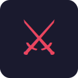

# Greedy Bastards

Arena melee FPS in Godot 4. Fight endless waves of goblins with a sword. Survive as long as you can.



## Gameplay

- **Attack** — flick the mouse fast (horizontal, vertical or diagonal — determines swing type)
- **Block** — hold RMB to raise the sword; parrying a hit rewards a powerful knockback
- **Dash** — double-tap any movement direction
- **Upgrades** — every wave clear opens a chest with 3 upgrade options
- **Coins** — dropped by enemies; used to buy upgrades

## Controls

| Action | Input |
|---|---|
| Move | WASD |
| Jump | Space |
| Attack | Mouse flick |
| Block / Parry | RMB hold |
| Dash | Double-tap WASD |
| Interact / Buy | E |
| Pause | Esc |

## Download

Grab the latest release from the [Releases](../../releases) page:

- **Linux** — `GreedyBastards-linux-x86_64.tar.gz` → extract and run `GreedyBastards.x86_64`
- **Windows** — `GreedyBastards-windows-x86_64.tar.gz` → extract and run `GreedyBastards.exe`

## Building from source

Requires **Godot 4.3+**.

```
# Open in editor
godot project.godot

# Headless export (requires export templates installed)
godot --headless --export-release "Linux/X11" build/linux/GreedyBastards.x86_64
godot --headless --export-release "Windows Desktop" build/windows/GreedyBastards.exe
```

## Tech

- **Engine** — Godot 4.6 (Jolt Physics)
- **Language** — GDScript
- **No external assets added at runtime** — all UI built in code via `StyleBoxFlat` + unicode icons

## Credits

By **ZeD** — converted from a Unity VR prototype.
